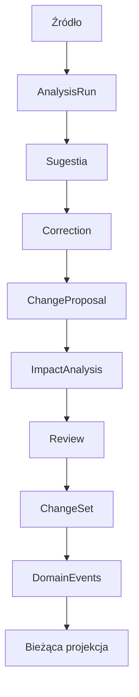

# Korekty użytkownika i rewizje planu — Etap 7

Korekta jest nowym rekordem wiedzy, a nie edycją historii. Runtime korzysta z istniejących projektów, decyzji, realizacji, AnalysisRun i relacyjnej AnalizaWplywu. `packages/domain` rozszerza używane kontrakty PropozycjaZmiany/ZestawZmian o parametr typu operacji i deklaruje KorektaUzytkownika; nie powstaje drugi model decyzji ani wpływu.

Korekta może również dotyczyć bezpośrednio projektu, punktu powrotu, decyzji, pracy, pytania lub blokera. Nie wymaga wcześniejszej sugestii.

## Rekord i Delta

`KorektaUzytkownika` zachowuje ID, projekt, typ/ID celu, pole, typ korekty, poprzednią i nową wartość, opis, powód, pochodzenie i odniesienie, autora i czas oraz status. Typy: FACT_CORRECTION, PREFERENCE_CHANGE, GOAL_CHANGE, SCOPE_CHANGE, PRIORITY_CHANGE, CONSTRAINT_CHANGE, TECHNICAL_CONSTRAINT, TEST_RESULT, REJECTION, OTHER. UI ma polskie etykiety.

PRZED jest odczytywane z aktualnego celu we wspólnej transakcji zgłoszenia, a nie przyjmowane z formularza. PO jest oryginalną propozycją użytkownika. Treść EDITED znajduje się osobno w review i ChangeSet; nie zastępuje oryginalnego PO. Pierwotny Capture, historyczny wynik analizy i jego review pozostają dostępne.

## Propozycje, wpływ i review

Zgłoszenie atomowo zapisuje Correction, ChangeProposal, istniejącą AnalizaWplywu ze źródłem CORRECTION i ActivityEvent. Nie zmienia projektu. Jedna główna operacja KOREKTA oraz osobne operacje WPLYW mają PENDING/ACCEPTED/EDITED/REJECTED i historię review. Każdy zapis review zwiększa reviewRevision; nie zmienia projekcji.

Kandydaci wpływu wynikają z jawnych relacji i wspólnego projektu: decyzje, punkt powrotu, istniejące elementy pracy, pytania, blokery i AnalysisRun. Nie jest to analiza semantyczna. Bezpośrednio zastępowana decyzja i bezpośrednio korygowany punkt powrotu nie otrzymują konfliktującej drugiej zmiany tego samego celu.

Przed apply trzeba rozstrzygnąć wszystkie propozycje. Można zaakceptować część i odrzucić pozostałe. EDITED głównej operacji stosuje dokładną treść użytkownika; dla RESUME edytuje następny krok, a dla pozostałych kandydatów wpływu edytuje uzasadnienie sprawdzenia. Nie zmienia to rodzaju proponowanego działania. Oryginalny kandydat pozostaje w AnalizaWplywu; treść po review ma oddzielne pola. Zwykła fasada ustaleń blokuje zastosowanie wpływu korekty poza jej ChangeSet.

Akceptacja REVIEW zachowuje potrzebę sprawdzenia powiązanego obiektu. Akceptacja DECISION_STATUS cofa istniejące ustalenie do PROPOSED według dotychczasowych reguł; RESUME zmienia następny krok. Przyszłe dokumenty/repozytoria nie otrzymują prowizorycznych encji.

## Atomowy zapis i historia

Apply odczytuje bieżący stan w UnitOfWork przez lokalny port `rewizje`. Ponownie sprawdza status, reviewRevision i oczekiwaną rewizję głównego celu; wpływ wykorzystuje dotychczasowe sprawdzanie wersji decyzji i punktu powrotu. Nieaktualna propozycja wymaga nowej korekty. W przypadku archiwum zapis jest blokowany.

W jednej transakcji zapisywane są zaakceptowane skutki, status korekty, rozstrzygnięcia wpływu, ChangeSet z kopią przyjętych operacji, DomainEventEnvelope i ActivityEvent. Promise kończy się po oncomplete. Błąd dowolnego zapisu, także DomainEvent, wycofuje całość. Identyczny retry zastosowanego ChangeSet nie powiela skutków; kolizja klucza idempotencji lub rewizji jest błędem. Całkowite odrzucenie zachowuje Correction i propozycje, ale nie tworzy pustego ChangeSet ani fikcyjnych DomainEvents zastosowania.

Zdarzenia domenowe mają typ, agregat, projekt, czas, aktora/źródło i strukturalny payload: correctionId, changeSetId, operationId, before, after. Typy: CORRECTION_VALUE_CHANGED, CORRECTION_KNOWLEDGE_RETAINED, CORRECTION_IMPACT_APPLIED. To trwały audyt skutków, bez deklaracji pełnego event sourcingu dawnej aplikacji. ActivityEvent zapewnia czytelną historię UI.

Korekta decyzji korzysta z istniejącej operacji zastąpienia: stara decyzja zachowuje treść i provenance, otrzymuje SUPERSEDED i wskazanie następcy. Korekta pól projektu/realizacji zachowuje poprzednią wartość w Correction oraz pełny przed/po w DomainEvent. Kolejna korekta tworzy osobny rekord. „Utwórz korektę odwracającą” tworzy nowe PRZED/PO i nowe review; nie cofa całego zestawu wpływu ani historii.

## Nowy AnalysisRun i odrzucenie sugestii

Zastosowana główna korekta Capture lub AnalysisRun pozwala jawnie uruchomić nowy run i oznaczyć go jako aktualny. Run zachowuje correctionId, inputText oraz supersedesAnalysisRunId. Dotychczasowy provider regułowy przetwarza zaakceptowaną treść korekty, nie rekonstruuje semantycznie całego oryginału. Oryginalny wpis pozostaje źródłem pochodzenia; inputText dokumentuje faktyczne wejście dostawcy. Nowy wynik nadal wymaga osobnego review.

Po sukcesie wybór aktualnego runu używa dotychczasowej operacji z oczekiwanym poprzednim preferred. Oba markery zmieniają się atomowo; pozostaje dokładnie jeden aktualny run z wynikiem. Błąd dostawcy zostawia FAILED i poprzedni aktualny wynik. Konflikt wyboru zachowuje zakończony nowy run i zgłasza błąd zamiast nadpisywać równoczesny wybór użytkownika. Historyczny output/review nie jest edytowany przez korektę.

REJECTION/PREFERENCE_CHANGE mogą zachować „Nie chcę Google Drive” ze wskazaniem źródła/analizy, autora, powodu i zaakceptowanej treści. Nie ma zaawansowanej pamięci semantycznej ani globalnego zakazu przyszłych sugestii. Dane i faktyczne wejście analizy są zachowane do przyszłego użycia.

## Rzeczywisty przykład obsługiwany przez kod i testy

Projekt ma opis „Wyłącznie lokalnie.”. Użytkownik zgłasza CONSTRAINT_CHANGE: „Dopuszczam Raspberry Pi jako prywatny hub; aplikacja nadal local-first.”, z powodem „Nowe wymaganie”.

1. System zachowuje poprzedni opis i tworzy propozycję zmiany opisu oraz kandydatów wpływu.
2. Użytkownik akceptuje główną zmianę i odrzuca zmianę punktu powrotu.
3. ChangeSet zawiera wyłącznie główną operację. DomainEvent zachowuje projekt przed/po, a odrzucona propozycja pozostaje dostępna.
4. Opis projektu zmienia się po zatwierdzeniu transakcji. Samo zgłoszenie lub review go nie zmienia.

Ten przykład zmienia ustalenie w projekcie; nie implementuje Raspberry Pi storage ani integracji Hubu.

## Persistence, backup i weryfikacja

IndexedDB v6 → v7 dodaje cztery puste magazyny: korekty, propozycjeZmian, zestawyZmian, zdarzeniaDomenowe. Nie przepisuje starych źródeł/runów/review. Upgrade ze starszych wersji nadal przechodzi przez istniejące migracje.

Backup v3 eksportuje 16 magazynów w jednym spójnym odczycie. Czytniki v1/v2 zachowują stare dane i uzupełniają puste nowe magazyny; v1 nadal migruje stare analizy do LEGACY_IMPORTED. Walidacja obejmuje cele i projekty, review, relacje Correction/ChangeProposal/ImpactAnalysis/ChangeSet/DomainEvents oraz powiązanie wejścia runu z zatwierdzoną korektą. Brak lub niezgodność skutków audytu blokuje import przed zapisem. Bezstratny adapter widoków v1 ↔ v2 pozostaje ograniczony do starego formatu; nie spłaszcza korekt do v1.

Testy obejmują wszystkie typy korekt, częściowe review/EDITED, odrzucenie, ponowną korektę i odwrócenie, zastępowanie decyzji, nowe/stare runy i preferred, błąd dostawcy, rollback DomainEvent/ChangeSet/ActivityEvent, konflikt rewizji, idempotencję, upgrade v6 → v7 i backup v1/v2 → korekta → v3 → restore. Testy UI sprawdzają trwałość, Delta i błędy formularza. jsdom/fake-indexeddb nie stanowią dowodu migracji rzeczywistych danych użytkownika ani działania na urządzeniu.
